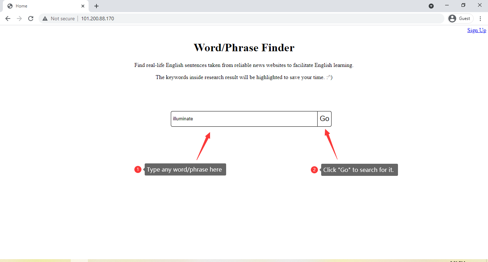
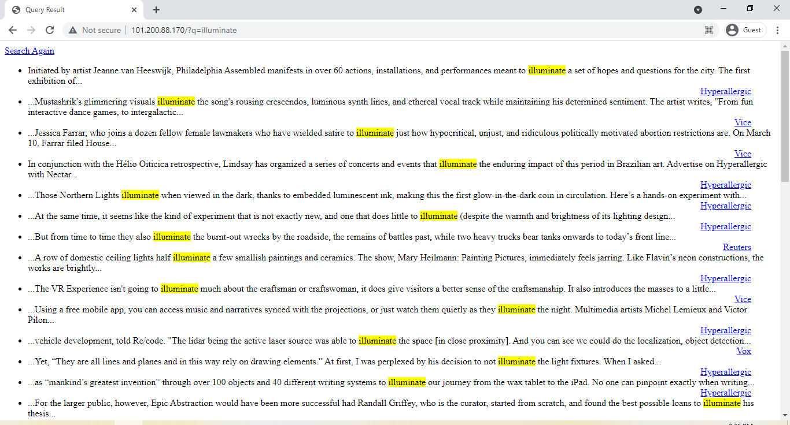

# Overview

High performance HTTP/1.1 server on Linux. 

# Contents
  * [Background](#background)
  * [Demo](#demo)
  * [TODOs](#todos)
  * [Benchmark](#benchmark)
  * [Build Environment](#build-environment)
  * [How to build?](#how-to-build)

## Background
Originally, this repo is just a barebone HTTP/1.1 server with terribly performance. One day, an idea hit me. I wanna a website that can display the real-life usage of words or phrases that appeared in reliable materials like news websites because I've beening learning English for many years and I stillllll have so much uncertainty in the language. I major in English not Computer Science, English language is really important in my daily life :stuck_out_tongue:. And by the way, the news database is downloaded from [2.7 million news articles and essays](https://components.one/datasets/all-the-news-2-news-articles-dataset/). The Sqlite3 database used in demo is just a tiny part of this huge dataset.

# Demo
You can easily look up an English word/phrase by typing it into the search bar( Ignore the bad-looking home page ) and click "Go" to search for it.



It will highlights the word/phrase that you search. And you can further go into the original page by clicking on the hyper-link at the right side of each entity.



## TODOs
- [ ] HTTP Request Method
  - [ ] HEAD
  - [x] GET
  - [ ] PUT
  - [ ] POST
- [ ] Performance Optimization
  - [x] Compression
  - [ ] Caching
  - [ ] Timer per connection
- [ ] Content Relevance
  - [ ] Order Query Results By Relevence

## Benchmark
Benchmark is done with the help of [siege](https://www.joedog.org/siege-manual/)

Recent benchmark with terribly bad performance :^)
```text
Transactions:                   6732 hits
Availability:                 100.00 %
Elapsed time:                  59.89 secs
Data transferred:              76.16 MB
Response time:                  8.23 secs
Transaction rate:             112.41 trans/sec
Throughput:                     1.27 MB/sec
Concurrency:                  925.22
Successful transactions:        6732
Failed transactions:               0
Longest transaction:           11.36
Shortest transaction:           0.00
```

## Build Environment
* Ubuntu 20.04.2 LTS
* GCC 9.3.0
* [Cmake](https://cmake.org/)
* [Googletest](https://github.com/google/googletest)

## How to build? 
```shell
git clone https://github.com/Bitate/HttpServer
cd HttpServer
bash build.sh
```

## Useful links that help me build this project

### HTTP Related

* HTTP Status Code
  * [HTTP status codes with concrete example](https://evertpot.com/http/)
  * [Mozilla HTTP response status codes](https://developer.mozilla.org/en-US/docs/Web/HTTP/Status#client_error_responses)
  * [HTTP Status Codes](https://httpstatuses.com/)


* Uri
  * https://nodejs.org/api/url.html#url_url


* Percent encoding
  * https://developer.mozilla.org/en-US/docs/Glossary/percent-encoding
  * https://tools.ietf.org/html/rfc3986#section-2.1
  * https://en.wikipedia.org/wiki/Percent-encoding
  * https://developer.twitter.com/en/docs/basics/authentication/oauth-1-0a/percent-encoding-parameters


* Message Content
  * https://stackoverflow.com/questions/18180539/how-to-determine-the-content-type-in-an-http-response
  * https://stackoverflow.com/questions/5661596/do-i-need-a-content-type-header-for-http-get-requests
  * http://httpd.apache.org/docs/2.2/mod/mod_mime.html#addtype
