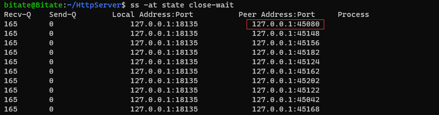
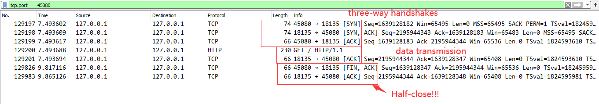
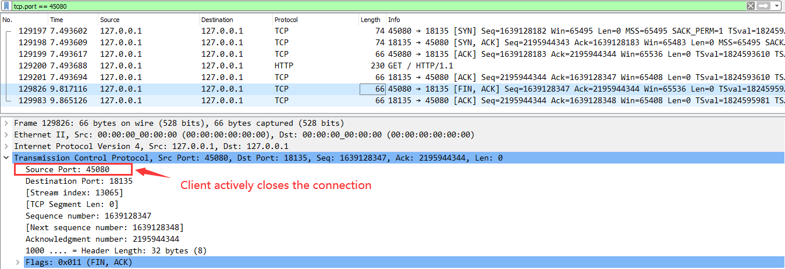

# Challenging Issues
## Server Architecture ?
One master process and N worker processes. (Where N equals the number of cores in the CPU). Each worker is single-threaded.

* One worker process per CPU core to reduce the cost of context switching.
* Non-blocking ( Non-waiting ) event-driven architecture;
* Listening fd and epfd is shared among workers;
* All processes use shared-memory IPC;
* The master process runs at `root` privilege while others run in unprivileged level.
* Use domain sockets to pass fds among processes;

Master process's role:
* Add worker sockets into epoll instance. If one worker obtains the accpet_mutex, that worker will sendmsg to master. Thus, the master send one fd from queue that contains the fds ready to be accepted to the worker. The worker maintain its own epoll instance. If the worker receive socket from master, then it accepts and process it.

Worker process's role:
* Accept and process connections;

## HTTP State Machine ?


# Lessons Learned

## accept() keeps returning '0'
Original code. It takes me nearly two hours to google why this happened. Normally, 0 means I closed the standard input. But I did'n close that fd. Finally... It turns out that I forget to add a pair of parentheses.
```cpp
sockaddr_in accepted_socket;
socklen_t accepted_socket_length = sizeof(sockaddr_in);
if(accepted_fd = accept(m_listening_socket, (sockaddr*)(&accepted_socket), &accepted_socket_length) == -1)
{
    Logger::error("master accept() error");
    continue;
}
```

Change it to:
```
if((accepted_fd = accept(m_listening_socket, (sockaddr*)(&accepted_socket), &accepted_socket_length)) == -1)
{
    Logger::error("master accept() error");
    continue;
}
```


## POSIX Semaphore
* The process who firstly call sem_open() must use O_EXCL to make sure the semaphore is a brand-new one. If first call to sem_open() returns EEXIST, call sem_unlin() then recall sem_open() again to create the new semaphore. Otherwise, the semaphore you create may has the wrong init value, which is unpredictable.

## How to add Unix Domain Socket to epoll fd?
Add it as normal Internet sockets.

## Multithreads VS Multiprocesses in Linux ?
* In Linux, thread == process == task.
* Major difference: the degree to which thread and process share memory.

## When is the EPOLLHUP triggered?
Use **tcpdump** to trace down into TCP transactions.


## Why there are so many CLOSE_WAIT tcp sockets in server side and so many FIN_WAIT_2 tcp sockets in client side?

To cut a long story short, those who in CLOSE_WAIT did not properly close the TCP connection. In my case, the server failed to close the connection after no more data to read/send.


If client call shutdown(SHUT_WR), the server will receive an EOF from read() system call. In TCP level, the server will receive a FIN from client. After the server's tcp send back an ACK. The server is in CLOSE_WAIT and client is in FIN_WAIT_2 and the TCP is in half-close.

### Analysis  
1. Use tcpdump to captuer all tcp packets on 127.0.0.1/localhost.

2. Use *ss* command to filter out all tcp connection that is in CLOSE_WAIT state. In this case, I choose the port*45080* which is used by the client socket.



3. Open capture file in wireshark and filter out the tcp connection with *127.0.0.1:45080*. Here we can clearly find out that the server(127.0.0.1:18135) do not close the connection! 



The server do send back an ACK to the FIN sent by client. At this time, server is in CLOSE_WAIT while client is in FIN_WAIT_2. The problem is that the server do not send a FIN after reading/writing. 



Conclusion: The server needs to close the connection properly. 

## IS EPOLLRDDUP equal to read() return 0, which means I do not need to handle the return value in read() call?
If EPOLLRDHUP got triggered, do not read the socket but close it immediately. However, it's possible that, before you call read(), a FIN arrives. So to be safer, close the socket with the return value of 0 of read().

## POST vs PUT ?
POST request uri points to the resource's manager/parent.
PUT request uri is exactly the resource uri.

```
// post a new user to the users collection.
POST /resources HTTP/1.1  

// create/update the john resource under the users collection.
PUT /resources/<newResourceId> HTTP/1.1 
```

RFC:
Let me highlight some important parts of the RFC:

POST
The POST method is used to request that the origin server accept the entity enclosed in the request as a **new subordinate** of the resource identified by the Request-URI in the Request-Line

Hence, creates a new **resource** on a **collection**.

PUT
The PUT method requests that the enclosed entity be stored under the supplied Request-URI. If the Request-URI refers to an already existing resource, the enclosed entity SHOULD be considered as a modified version of the one residing on the origin server. If the Request-URI does not point to an existing resource, and that URI is capable of being defined as a **new resource** by the requesting user agent, the origin server can create the resource with that URI."

Hence, create or update based on existence of the resource.

Reference:
* https://stackoverflow.com/a/18243587/11850070